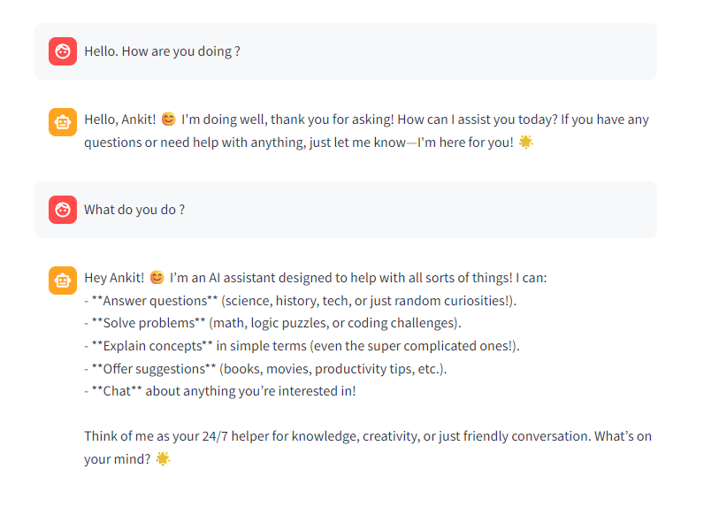

# LangGraph Streamlit Chatbot

A conversational AI chatbot built with **LangGraph** + **Streamlit**, powered by **Groq** (Qwen3-32B).

## Screenshot



## Stack

- **LangGraph** — stateful conversation graph with `InMemorySaver` checkpointer
- **Streamlit** — chat UI with `st.chat_message` / `st.chat_input`
- **Groq** — LLM inference via `langchain_groq` (model: `qwen/qwen3-32b`)

## Project Structure

```
langgraph_streamlit_chatbot/
├── chat_backend.py       # LangGraph workflow definition
├── streamlit_frontend.py # Streamlit UI
└── main.py
```

## Setup

```bash
pip install streamlit langgraph langchain-groq langchain-core python-dotenv
```

Create `.env`:

```
GROQ_API_KEY=your_key_here
```

## Run

```bash
streamlit run streamlit_frontend.py
```
